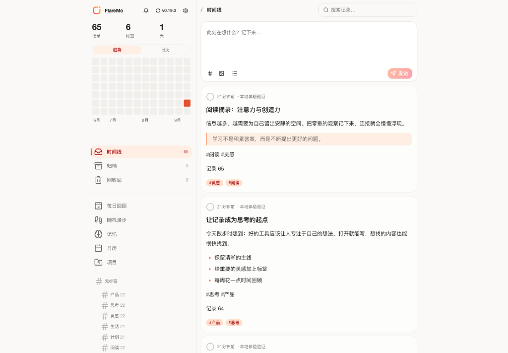
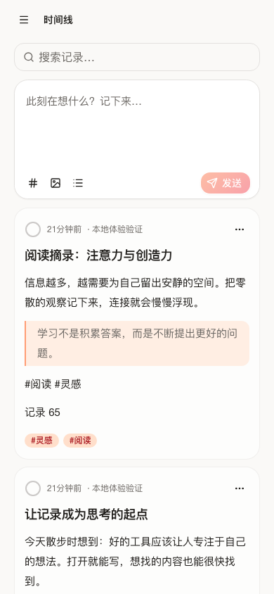

# FlareMo 🔥

<p align="center">
  <b>서버 제로 · 유지보수 비용 제로 · 24시간 글로벌 엣지 상시 가동 · 완전한 데이터 소유권</b><br>
  개인에게는 조용하고 집중할 수 있는 생각 기록 공간이자 AI 제2의 뇌, 팀에게는 세밀한 권한 관리를 갖춘 공유 지식 베이스.
</p>

<p align="center">
  <a href="./README.md">English</a> •
  <a href="./README.zh-CN.md">简体中文</a> •
  <a href="./README.ja.md">日本語</a> •
  <a href="./README.fr.md">Français</a> •
  <a href="./README.es.md">Español</a> •
  <a href="./README.ko.md"><b>한국어</b></a> •
  <a href="./README.ru.md">Русский</a> •
  <a href="./README.ar.md">العربية</a>
</p>

<p align="center">
  <a href="https://github.com/realchendahuang/FlareMo/stargazers"></a>
  <a href="./LICENSE"></a>
  <a href="https://workers.cloudflare.com/"></a>
  <a href="https://github.com/usememos/memos"></a>
  <a href="https://www.better-auth.com/"></a>
  <a href="https://flaremo.app"></a>
</p>

<div align="center">

| ☀️ 데스크톱 · 라이트 모드 | 🌙 데스크톱 · 다크 모드 | 📱 모바일 · 반응형 |
| :---: | :---: | :---: |
|  |  |  |

<sub>실제 실행 화면: 라이트/다크 테마 간 매끄러운 전환 및 모바일 완벽 대응. 화면에 표시된 모든 기능은 백엔드와 완전히 연동되어 있습니다.</sub>

</div>

---

## 💡 왜 FlareMo인가?

Flomo와 Memos 같은 도구들은 부담 없는 메모 작성과 타임라인 인터페이스가 주는 가치를 증명했습니다. 그러나 기존 노트를 자체 호스팅하려면 매월 청구되는 VPS 비용을 감당하고, Docker 및 PostgreSQL을 설정하며, 백업 스크립트를 관리하고, 하드웨어 고장의 불안감을 안고 살아야 했습니다.

FlareMo는 전혀 다른 해답을 제시합니다: **무료 Cloudflare 계정 하나만으로 서버 비용 없이, 데이터베이스 유지보수 없이, 24시간 온라인으로 전 세계 어디서나 초저지연으로 접근 가능한 지식 베이스를 구축할 수 없을까?**

- **진정한 서버리스(Serverless)**: 코드와 정적 프론트엔드가 전 세계 300여 개 Cloudflare 엣지 노드에서 실행되어 밀리초 단위로 응답합니다.
- **엔터프라이즈급 내구성**: Cloudflare D1이 메모와 메타데이터를 저장하고, 멀티 리전으로 복제되는 Cloudflare R2가 미디어 첨부파일을 안전하게 보관합니다.
- **AI 네이티브 아키텍처**: 표준 MCP 프로토콜과 'Agent Memory' 장기 기억 허브가 내장되어 있어 Claude, Cursor, ChatGPT 등의 AI가 당신의 생각을 공유하고 기억합니다.
- **개인의 고요함과 팀의 협업**: 기본적으로는 안전한 1인용 비밀 노트이며, 팀 모드를 켜면 역할 기반 권한과 3단계 공개 범위를 갖춘 협업 공간으로 변신합니다.

---

## ✨ 핵심 기능

### 1. 즉각적인 메모 작성 & 영감을 주는 회고
- **열자마자 바로 작성**: 카드형 스트림 타임라인, 다중 태그 분류, Markdown/GFM 렌더링, 이미지 및 오디오 첨부 미리보기.
- **초고속 전체 텍스트 검색**: SQLite FTS5 지원 (`has:attachment`, `is:pinned`, `before:YYYY-MM-DD` 등의 필터 지원).
- **벡터 의미론적 '찾아보기'**: Workers AI 임베딩과 Vectorize 인덱스를 결합하여 문맥과 의도로 검색하며, 미지원 시 FTS5로 부드럽게 대체됩니다.
- **기억 활성화**: **일일 회고** (과거 오늘의 기록), **랜덤 워크** (태그와 링크 그래프 탐색 + 요약 엽서), 상세 페이지 관련 메모 추천.
- **버전 이력 관리**: 변경 사항 비교 및 클릭 한 번으로 과거 리비전 복원.

### 2. AI 장기 기억 및 MCP 네이티브 연동
- **Agent Memory**: `/memory/mcp` 엔드포인트를 통해 AI 에이전트가 세션을 초월한 장기 기억(선호도, 프로젝트 결정 사항, 제약 사항)을 읽고 쓸 수 있습니다.
- **인간 중심 제어**: `/memory` 화면에서 AI가 축적한 기억을 확인하고 고정하거나 수정할 수 있습니다.
- **표준 MCP 지원**: Streamable HTTP MCP(`/mcp`) 엔드포인트로 프로그래밍 방식의 메모 조작을 지원합니다.

### 3. 팀 협업 및 3단계 권한 제어
- **명확한 역할 체계**: `owner`, `admin`, `member`. 관리자가 1회용 활성화 링크를 발급하고 구성원이 직접 비밀번호를 설정합니다.
- **3단계 공개 범위**:
  - 🔒 **비공개**: 작성자 본인만 열람 가능.
  - 👥 **팀 공개**: 유효한 팀원에게 읽기 전용 공유.
  - 🌐 **전체 공개**: 만료 기간 설정이 가능한 안전한 공개 링크.
- **안전한 멤버 탈퇴**: 멤버 제거 시 비공개 데이터는 완전히 물리적 삭제되고 팀 및 공개 메모는 보존됩니다.

### 4. 오프라인 우선 & PWA 지원
- **설치형 PWA**: PC나 스마트폰 홈 화면에 설치하여 네이티브 앱과 동일한 사용감을 제공합니다.
- **신뢰할 수 있는 오프라인 동기화**: 네트워크가 끊겨도 로컬에 즉시 임시 저장되며, 재연결 시 대기 큐가 순서대로 안전하게 제출됩니다.
- **실시간 음성 속기**: `/capture` 페이지에서 실시간 스트리밍 음성 인식(ASR)으로 빠르게 텍스트를 기록할 수 있습니다.

### 5. 강력한 Better Auth 보안
- **보안 세션**: 브라우저는 `HttpOnly`, `SameSite=Lax` 쿠키 세션을 사용하며, 스크립트나 MCP에는 폐기 가능한 Personal Access Token (`memos_pat_`)을 발급합니다.
- **엄격한 Origin 보호**: 상태 변경 요청(POST/PATCH/DELETE) 시 엄격한 Origin 검증을 수행합니다.

### 6. Memos 생태계 호환 및 손쉬운 이전
- **Memos API 호환**: `/api/v1/*` 핵심 엔드포인트 및 OpenAPI 규격 지원.
- **서드파티 클라이언트 연동**: Moe Memos 등 기존 Memos 모바일 앱에서 직접 연결 가능.
- **양방향 가져오기/내보내기**: Memos 및 flomo 데이터 패키지 일괄 가져오기 및 전체 내보내기 지원.

---

## 📊 Cloudflare 무료 제공량은 얼마나 충분한가요?

| 리소스 | 무료 제공량 | 환산 용량 | 실제 사용 가능 기간 |
| :--- | :--- | :--- | :--- |
| **Cloudflare D1** | **5 GB 데이터베이스** | 약 **250만 개**의 텍스트 메모 | 매일 100개씩 작성해도 **68년간** 사용 가능 |
| **Cloudflare R2** | **10 GB 오브젝트 스토리지** | 약 **5,000–10,000장** 사진 / **80시간** 음성 | **$0 아웃바운드 트래픽 비용**으로 요금 걱정 제로 |
| **Cloudflare Workers** | 넉넉한 일일 무료 요청량 | 전 세계 300개 이상의 엣지 노드 | 콜드 스타트 없는 즉각적인 밀리초 응답 |

---

## 🚀 5분 빠른 배포

### 방법 1: AI 에이전트로 자동 배포 (권장)

명령어 실행이 가능한 AI 에이전트(Claude Code, Cursor Agent, Codex)에 [docs/agent-deploy.md](./docs/agent-deploy.md) 문서를 전달하세요:
> "docs/agent-deploy.md 안내에 따라 내 Cloudflare 계정에 FlareMo를 배포해 줘."

---

### 방법 2: 3단계 수동 배포

#### 1. 리소스 생성
```bash
pnpm exec wrangler whoami
pnpm exec wrangler d1 create flaremo
pnpm exec wrangler r2 bucket create flaremo-attachments
```

#### 2. 설정 파일 및 비밀값 등록
```bash
cp wrangler.jsonc.example wrangler.jsonc
# wrangler.jsonc 파일에 database_id 및 FLAREMO_PUBLIC_URL 입력
pnpm exec wrangler secret put BETTER_AUTH_SECRET --config ./wrangler.jsonc
pnpm exec wrangler secret put FLAREMO_BOOTSTRAP_SECRET --config ./wrangler.jsonc
```

#### 3. 배포 실행
```bash
pnpm verify
pnpm deploy:dry-run
pnpm deploy
```
배포 완료 후 브라우저에서 `/setup`에 접속하여 설정한 `FLAREMO_BOOTSTRAP_SECRET`을 입력하고 관리자 계정을 생성합니다.

---

## 📄 라이선스

본 프로젝트는 [GNU AGPL-3.0](./LICENSE) 라이선스에 따라 오픈소스로 제공됩니다.
Copyright (c) 2026 realchendahuang.
